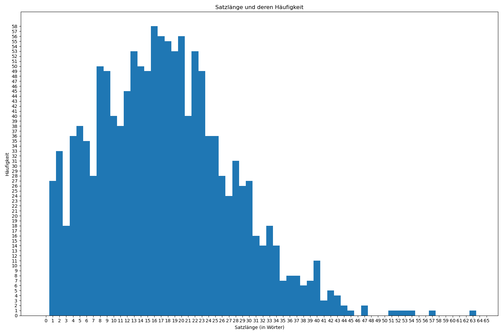
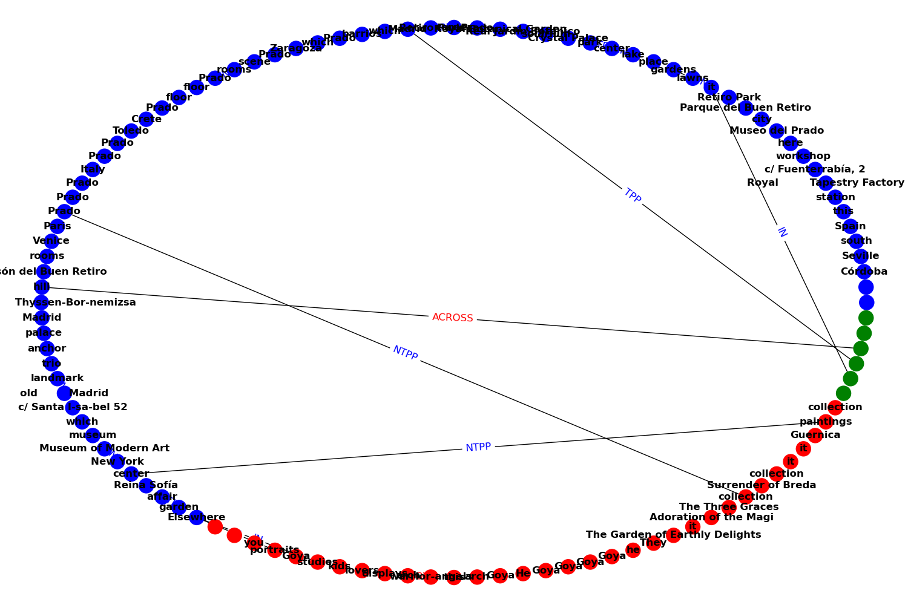
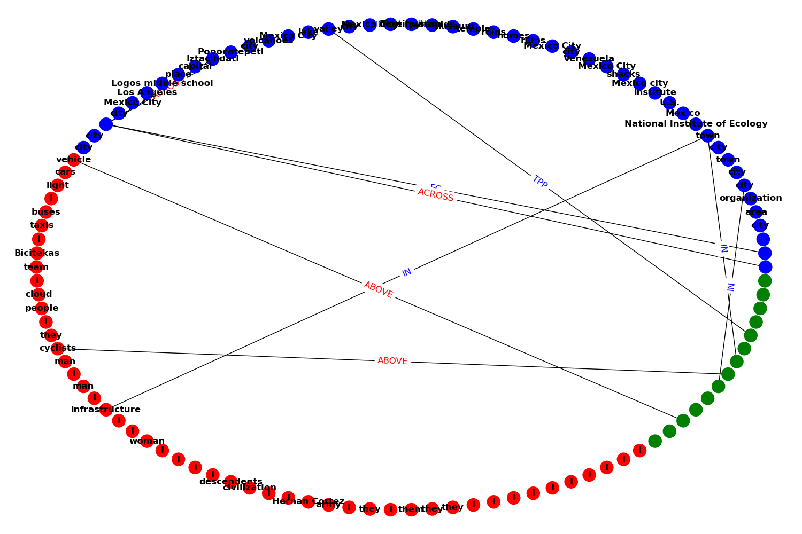

# Aufgabe 1
Die Datenschutz relevanten Daten liegen im Ordner Datenschutz/

# Aufgabe 2.1,2.2,2.3

Die Aufgaben 2.1,2.2,2.3 sind in der Datei main.py, einfach die datei ausführen und die Ergebnisse werden auf der Console geprintet.
Man kann sich die Ergebnisse auch in der output.pdf Datei anschauen (Graph ist auch dabei).

 

# Aufgabe 2.4
Die Aufgabe 2.4 ist Aufgabe2_4.py. Einfach ausführen.
Du kannst enterweder die Log_2020-11-19.pdf öffnen, oder die Aufgaben einzeln ausführen.

# Highlights_of_the_Prado_Museum
 
# Bicycles
 